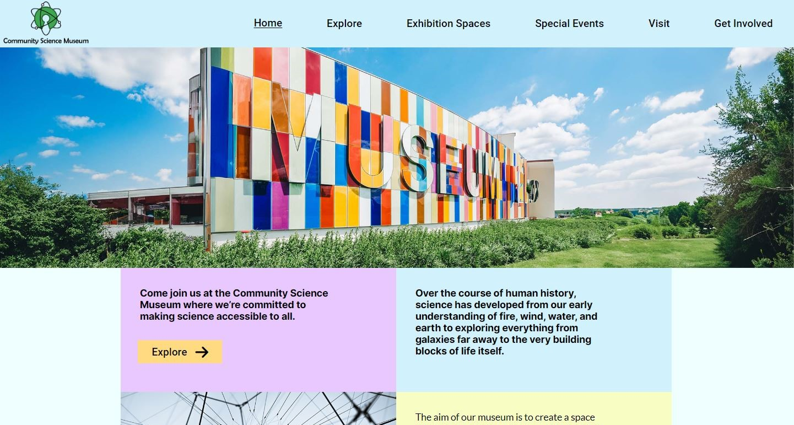

# Semester Project 1 - Community Science Museum


This website is my submission for Semester Project 1 at my Front-end Development studies at Noroff Vocational School.

## Description

This project aims to design and develop a modern, accessible, and responsive web presence for an interactive museum called the "Community Science Museum". The target audience is primary and middle school children and families. The main goal is to excite people enough to come visit the museum. The theme should not be overly childish, but still appeal to children.

## Built With

- HTML
- CSS
- Visual Studio Code

## Getting Started
### Installing

To get a local copy up and running follow this:

1. **Clone the repo:**
   ```bash
   git clone https://github.com/TheRegzi/Semester-Project-1.git

## Contributing

If you have a suggestion that would make this better, please fork the repo and create a pull request.

1. Fork the Project
2. Create your Feature Branch (git checkout -b feature/AmazingFeature)
3. Commit your Changes (git commit -m 'Add some AmazingFeature')
4. Push to the Branch (git push origin feature/AmazingFeature)
5. Open a Pull Request

## Contact
[My LinkedIn Page](https://www.linkedin.com/in/regine-dille-kornbakk-aa0a7b288/)

## Website Link
https://theregzi.github.io/Semester-Project-1/


